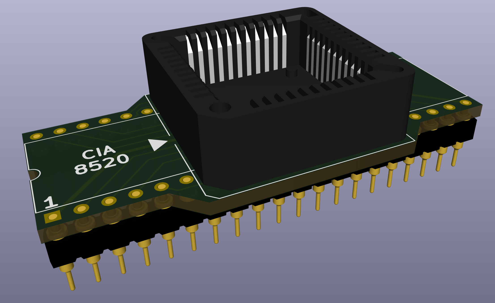
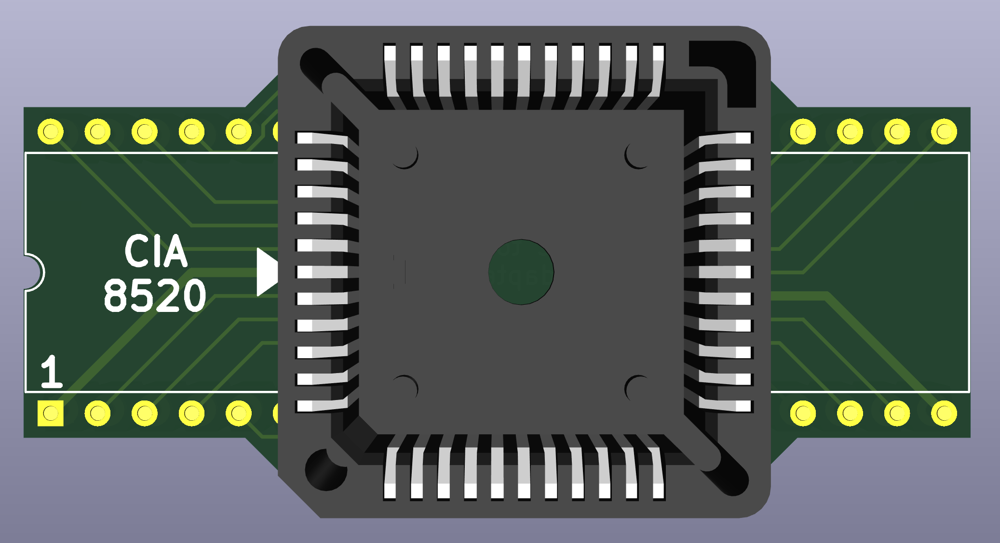
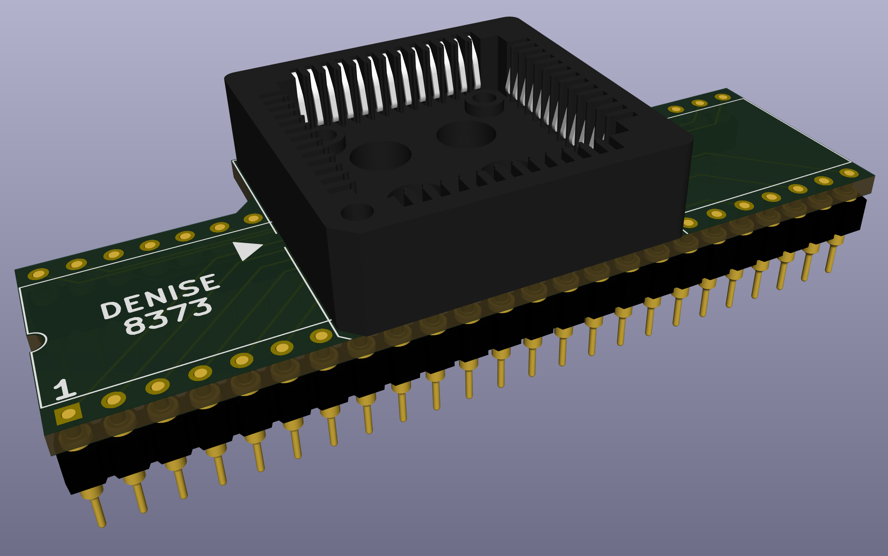
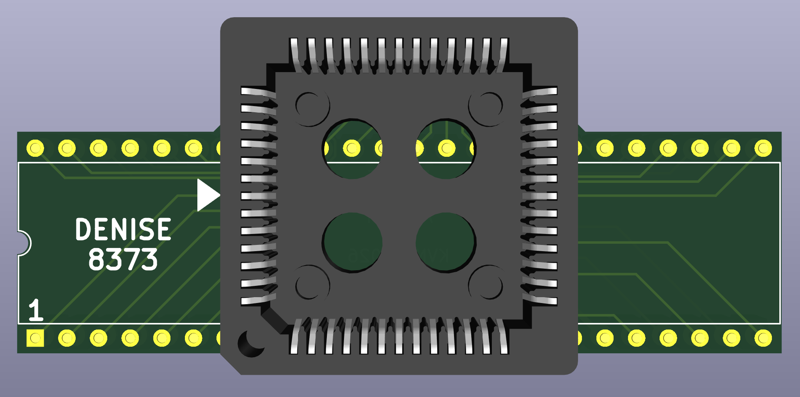
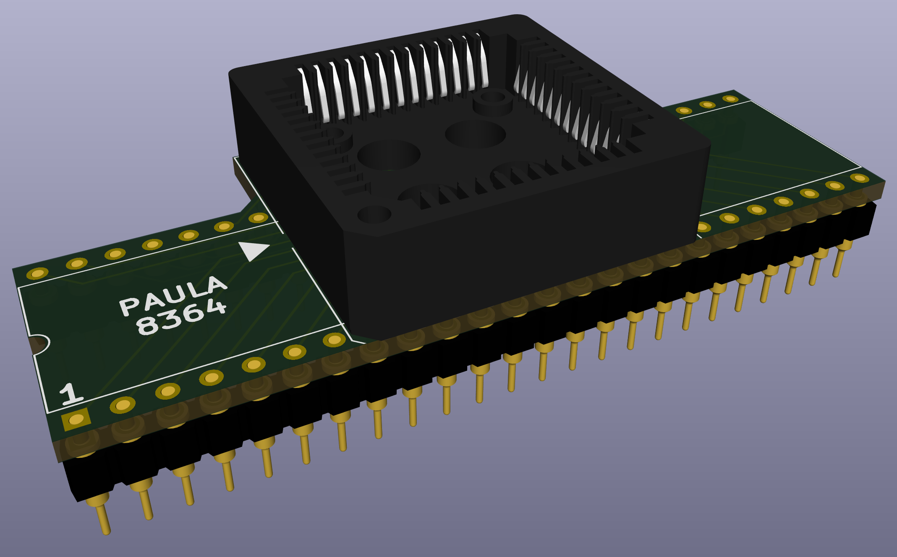
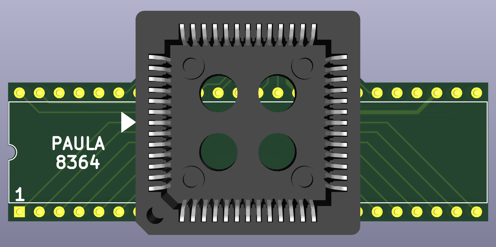

# Amiga-PLCC-DIP-Adapters

Adapters to use PLCC Amiga chips on DIP sockets.

When building:
1. Optional but recommended: Place the PLCC socket (do not solder) and trim the pins flush to the PCB.
2. Use a breadboard to help with aligning the round pin headers
3. Place the PCB on top of the pin headers
4. Solder the first and last pins
5. Trim the pin headers that fall within the PLCC socket area
6. Solder the rest of the pins.
7. Place and solder the PLCC socket.

Feel free to use, copy, modify, sell.

